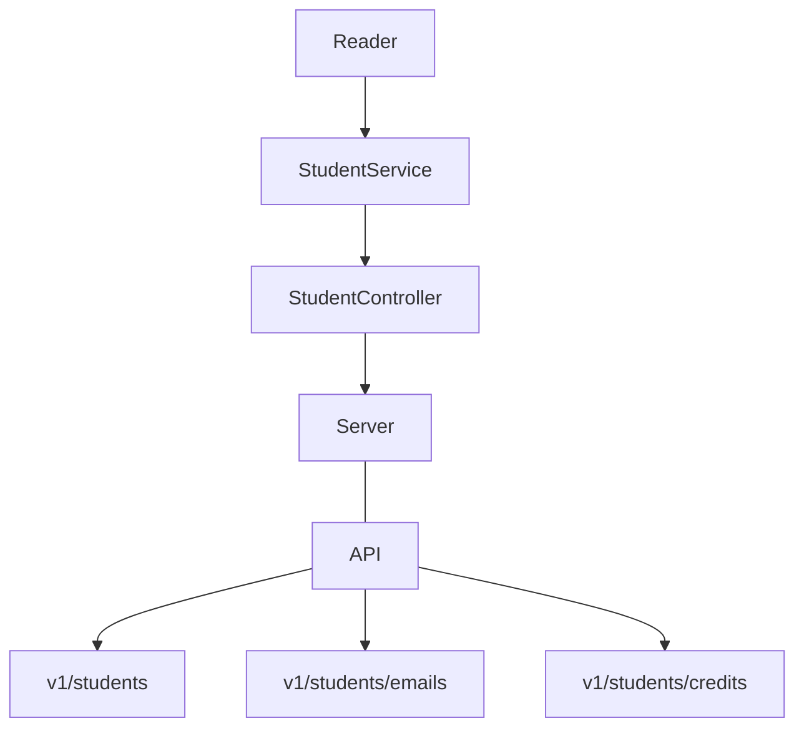
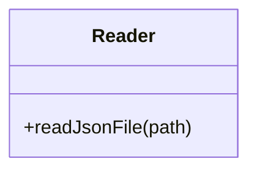
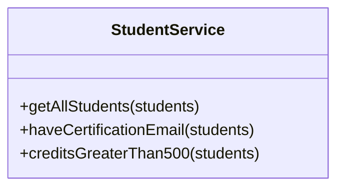
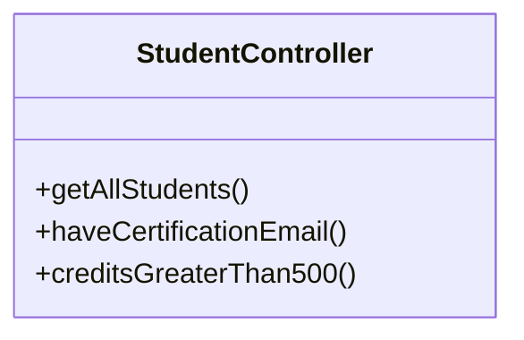

# __Visual Thinking API__

## __Dependencias__
- Express: Utilizado para crear el servidor de la API y procesar el HTTP correspondiente.
- ESLint: Permite estandarizar el formato del código escrito. Utiliza convenciones del lenguaje para evitar errores y facilitar su legibilidad.
- Jest: Para la creación de pruebas unitarias.

## __Diseño de los componentes__


### __Reader__
Utilizando la función ```readJsonFile(path)``` retornará el archivo JSON que se encuentra en el path especificado.

### __Student Service__
- `getStudents(students)`: Retorna un arreglo de objetos con  los datos de todos los estudiantes.
- `haveCertification(students)`: Retorna un arreglo de objetos con los datos de todos los estudiantes que tienen certificación.
- `haveCertificationEmail(students)`: Retorna un arreglo de objetos con los emails de los estudiantes que tienen certificación.
- `creditsGreaterThan500(students)`: Retorna un arreglo de objetos con los datos de todos los estudiantes que tienen más de 500 créditos.



### __Student Controller__
- `getAllStudents()`: Retorna un arreglo de objetos con los datos de todos los estudiantes.
- `haveCertificationEmail()`: Retorna un arreglo de objetos con los emails de los estudiantes que tienen certificación.
- `creditsGreaterThan500()`: Retorna un arreglo de objetos con los datos de todos los estudiantes que tienen más de 500 créditos.

